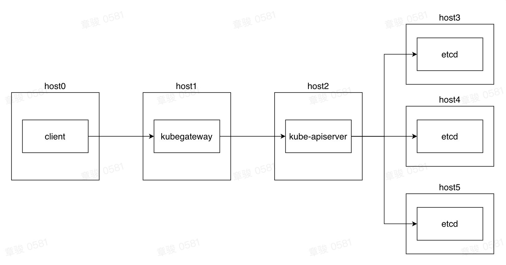

# Benchmark

## Objective

- Test for increased latency to APIServer after API requests go through KubeGateway.

## Non-objectives

- Ultimate pressure of APIServer;

- Ultimate pressure of KubeGateway.

## Test Preparation

### Test Models

Model information of the node where the APIServer is located:

- CPU: Intel(R) Xeon(R) Platinum 8260 CPU @ 2.40GHz
- Memory: 376 GB
- Disk: 1 SSD with a total capacity of 1863 GB
- NIC: 25000Mb/s

Model information of the node where the KubeGateway is located:

- CPU: Intel(R) Xeon(R) Platinum 8260 CPU @ 2.40GHz
- Memory: 376 GB
- Disk: 1 SSD with a total capacity of 1863 GB

- NIC: 25000Mb/s

### Deployment

Deploy 1 node of KubeGateway + 1 node of KubeAPIServer + 3 nodes of ETCD.

### Additional Instructions

Our target is to test the increased latency of requests after passing through KubeGateway. In order to reduce the interference of additional factors, we try to terminate the flow in kube-apiserver. That is, let all requests hit the cache in kube-apiserver. Since kube-apiserver has extra processing for pods (e.g. pod gc deletes non-compliant pods), we use configmaps as the request data. Create the configmaps required for testing in kube-apiserver in advance and start testing.

In the test data below, the results are based on Get. The Create data is for reference only, due to the interference of etcd processing delay.

In addition, since the authentication method for tokens in KubeGateway requires an additional request, the test makes a distinction.

## Test Data

| TestCase: GET Configmap | Client QPS | Authentication Method | min   | mean        | P50     | P90      | P95       | P99       | max       | KubeGateway throughput | KubeAPIServer throughput |
| ----------------------- | ---------- | --------------------- | ----- | ----------- | ------- | -------- | --------- | --------- | --------- | ---------------------- | ------------------------ |
| KubeAPIServer           | 5000       | TLS                   | 74ns  | **1.517ms** | 1.121ms | 1.292ms  | 1.362ms   | 14.112ms  | 125.575ms | 0                      | 5000                     |
| KubeAPIServer           | 5000       | TLS                   | 925ns | **1.662ms** | 1.144ms | 1.311ms  | 1.382ms   | 20.328ms  | 140.032ms | 0                      | 4999                     |
| KubeAPIServer           | 5000       | TLS                   | 73ns  | **1.677ms** | 1.168ms | 1.334ms  | 1.401ms   | 17.406ms  | 144.379ms | 0                      | 4999                     |
| KubeAPIServer           | 5000       | TLS                   | 448ns | 1.579ms     | 1.105ms | 1.27ms   | 1.341ms   | 12.088ms  | 206.709ms | 0                      | 4999                     |
| KubeAPIServer           | 5000       | TLS                   | 170ns | 1.659ms     | 1.157ms | 1.321ms  | 1.391ms   | 14.116ms  | 206.099ms | 0                      | 4999                     |
| KubeGateway             | 5000       | TLS                   | 207ns | 2.445ms     | 1.659ms | 2.013ms  | 2.822ms   | 26.27ms   | 214.799ms | 5000                   | 5000                     |
| KubeGateway             | 5000       | TLS                   | 500ns | 3.021ms     | 1.65ms  | 2.008ms  | 2.971ms   | 33.045ms  | 676.782ms | 5000                   | 5000                     |
| KubeGateway             | 5000       | TLS                   | 84ns  | 2.353ms     | 1.649ms | 1.994ms  | 2.851ms   | 20.31ms   | 232.801ms | 5000                   | 5000                     |
| KubeGateway             | 5000       | Token (no cache)      | 361ns | 16.304ms    | 3.054ms | 16.571ms | 107.589ms | 262.313ms | 1.732s    | 4999                   | 10000                    |
| KubeGateway             | 5000       | Token (600s cache)    | 648ns | 2.528ms     | 1.574ms | 1.913ms  | 2.401ms   | 32.582ms  | 314.817ms | 4999                   | 4999                     |

| TestCase:Create Configmaps | Client QPS | min   | mean     | P50     | P90      | P95      | P99       | max       | KubeGateway throughput | KubeAPIServer throughput |
| -------------------------- | ---------- | ----- | -------- | ------- | -------- | -------- | --------- | --------- | ---------------------- | ------------------------ |
| kubeAPIServer              | 10000      | 514ns | 9.856ms  | 2.537ms | 22.38ms  | 57.267ms | 125.353ms | 520.691ms | 9999                   | 9999                     |
| kubeAPIServer              | 10000      | 575ns | 9.483ms  | 2.373ms | 18.086ms | 55.129ms | 126.363ms | 521.442ms | 9999                   | 9999                     |
| KubeGateway                | 10000      | 684ns | 11.945ms | 3.615ms | 21.796ms | 47.491ms | 150.707ms | 1.333s    | 9941                   | 9941                     |
| KubeGateway                | 10000      | 813ns | 9.786ms  | 3.557ms | 14.152ms | 37.787ms | 109.144ms | 1.075s    | 9993                   | 9993                     |
| KubeGateway                | 10000      | 436ns | 12.104ms | 3.717ms | 24.044ms | 56.261ms | 143.505ms | 1.173s    | 9984                   | 9984                     |

## Conclusion

1. The increase in latency after a request passes through the KubeGateway consists of two components:
   1. KubeGateway's preprocessing of requests, which adds 1-200 ms, about 3-5ms on average;
   2. Network latency from KubeGateway to APIServer, entirely determined by network conditions.
2. The increase in request latency from KubeGateway is not significant,  and is less than the increase in network latency and latency after the request has penetrated to etcd.
3. The pressure on the single node of the APIServer should be controlled to prevent it from being overloaded, thus ensuring stability.
