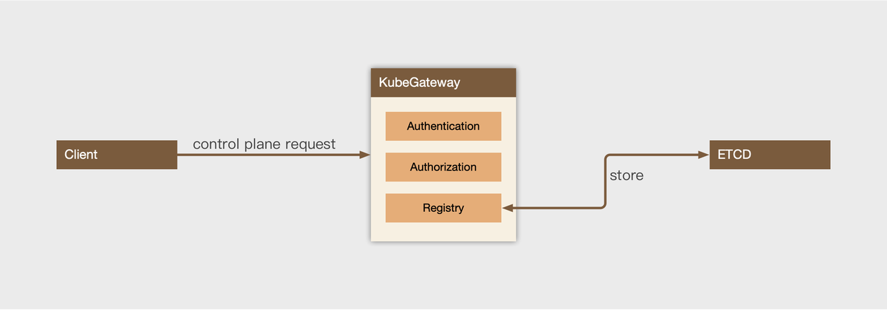
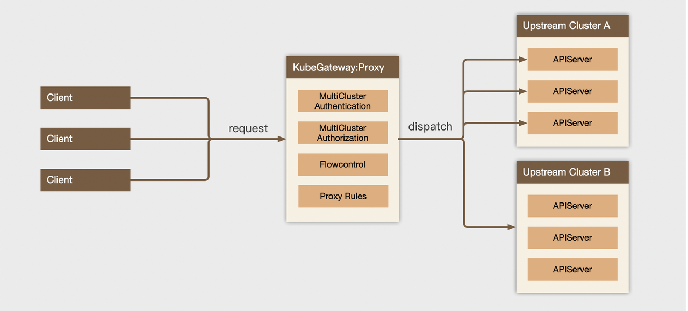
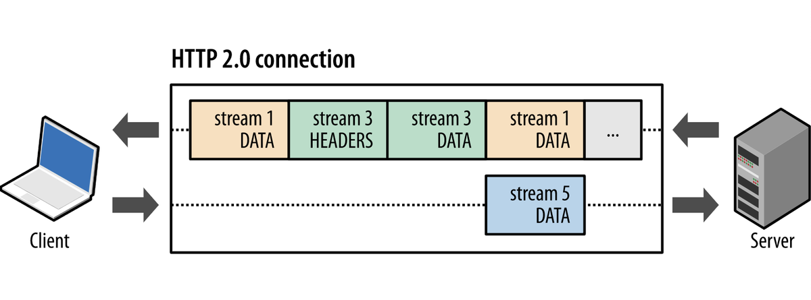

# Design

## Explanation of Terms

| Terms              | Meanings                                                     |
| ------------------ | ------------------------------------------------------------ |
| Upstream APIServer | APIServer proxied by KubeGateway is called Upstream APIServer |
| Upstream Cluster   | A group of the same APIServer is called an Upstream Cluster  |
| Endpoint           | The address of an Upstream APIServer, and the format is "schema://host: port", such as https://192.168.0.1:6443 |
| impersonate        | A special mechanism provided by Kubernetes APIServer that allows a user to impersonate another user to perform a request |

## Architecture Design

In terms of structure, it is divided into two aspects:

- Control plane:  A complete kube-like apiserver that provides CRUD operations for proxy clusters and routes;

- It proxies traffic to the upstream cluster, provides partial authN/Z functions, flexible route matching rules, and flexible flow limit rules.

### Control Plane Design



The control plane of KubeGateway is equivalent to a complete kube-apiserver:

1. It has robust Authentication and Authorization;
2. It provides CRUD operations on control plane resources such as proxy rules;
3. It supports list/watch operations, that is, you can use client-go to make configuration changes directly without additional SDK.

### Proxy Layer Design



At the proxy layer:

- After the request goes through the authentication module, the module determines the requested user information. And if necessary, it will verify authorization;

- Then in the route matching module, the module determines which upstream kube-apiserver the request should be forwarded to;

- When the request goes through the flow control module:
  - Determine whether to limit its flow;
  - Select a suitable kube-apiserver as the forwarding object according to the load balancing algorithm of polling scheduling (RoundRobin);

- Forwarding the request to the kube-apiserver in the backend via a pre-created HTTP2 connection.

## Detailed Design on Control Plane

###  API

```Go
// UpstreamClusterSpec defines the desired state of UpstreamCluster
type UpstreamClusterSpec struct {
    // Servers contains a group of upstream api servers
    Servers []UpstreamClusterServer `json:"servers,omitempty" protobuf:"bytes,1,rep,name=servers"`

    // Client connection config for upstream api servers
    ClientConfig ClientConfig `json:"clientConfig,omitempty" protobuf:"bytes,2,opt,name=clientConfig"`

    // Secures serving config for upstream cluster
    SecureServing SecureServing `json:"secureServing,omitempty" protobuf:"bytes,3,opt,name=secureServing"`

    // Client flow control settings, e.g. qps and burst
    FlowControl FlowControl `json:"flowControl,omitempty" protobuf:"bytes,4,opt,name=flowControl"`

    // DispatchPolicies describes how to dispatch requests to upsteams.
    // Only one dispatch policy will be matched
    // The router will follow the order of DispatchPolicies, that means
    // the previous policy has higher priority
    DispatchPolicies []DispatchPolicy `json:"dispatchPolicies,omitempty" protobuf:"bytes,5,rep,name=dispatchPolicies"`
}
```

We designed an UpstreamCluster API resource to represent a backend cluster that needs to be proxied by KubeGateway, which contains:

- Backend cluster list;
- The client information that KubeGateway access to backend cluster;
- Server certificate and CA certificate are used to provide dynamic SNI;
- Flow control information;
- Routing.

For more API content, please refer to: TODO Add Link

### ClientConfig Permissions

When configuring the clientConfig for the upstream cluster, you need to give the kube-gateway enough permissions to access the upstream cluster to make it work properly. There are three main behaviors for kube-gateway to access upstream:

1. Health check;
2. Authentication Request (TokenReview) and Authorization Request (SubjectReview);
3. impersonate to another user.

So the minimum permissions it requires are as follows:

```YAML
apiVersion: rbac.authorization.k8s.io/v1
kind: ClusterRole
metadata:
  name: kube-gateway
rules:
- apiGroups: [""]
  resources: ["users", "groups", "serviceaccounts"]
  verbs: ["impersonate"]
# Can set "Impersonate-Extra-scopes" header and the "Impersonate-Uid" header.
- apiGroups: ["authentication.k8s.io"]
  resources: ["userextras/scopes", "uids"]
  verbs: ["impersonate"]
- apiGroups: ["authentication.k8s.io"]
  resources: ["tokenreviews", subjectaccessreviews]
  verbs: ["create"]
- nonResourceURLs: ["/healthz*", "/readyz*", "/livez*"]
  verbs: ["get"]
```

Then bind the `ClusterRole` with the user of kube-gateway:

```YAML
apiVersion: rbac.authorization.k8s.io/v1
kind: ClusterRoleBinding
metadata:
  name: kube-gateway
subjects:
- kind: User
  name: kube-gateway # This should be your client config user name
  apiGroup: rbac.authorization.k8s.io
roleRef:
  kind: ClusterRole
  name: kube-gateway
  apiGroup: rbac.authorization.k8s.io
```

### FlowControl

There are three methods of flow control：

- Exempt: Indicates no limit;
- MaxRequestsInflight: Indicates a limit on the maximum number of concurrency, which is different from qps  and indicates how many requests can be processed at the same time;
- TokenBucket: Limit the number of requests by token buckets and allow burst.

## Detailed Design on Proxy Layer

### Routing

Each DispatchPolicy represents a routing rule in the UpstreamCluster API, and the priority of multiple routing rules taking effect is determined by the order of the list.

#### DispatchPolicy API Definition

```Go
type DispatchPolicy struct {
    // Specifies a load balancing method for a server group
    Strategy Strategy `json:"strategy,omitempty" protobuf:"bytes,1,opt,name=strategy,casttype=Strategy"`
    // UpsteamSubset indacates to the list of upstream endpoints. An empty set
    // means use all upstreams
    // +optional
    UpsteamSubset []string `json:"upsteamSubset,omitempty" protobuf:"bytes,2,rep,name=upsteamSubset"`
    // Rules holds all the DispatchPolicyRules for this policy
    // Gateway matches rules according to the list order, the previous rules
    // take higher precedence
    // +optional
    Rules []DispatchPolicyRule `json:"rules,omitempty" protobuf:"bytes,3,rep,name=rules"`
    // FlowControlSchemaName indicates to which flow control schema in spec.FlowControl will
    // take effect on this prolicy
    // If not set, there is no limit
    FlowControlSchemaName string `json:"flowControlSchemaName,omitempty" protobuf:"bytes,4,opt,name=flowControlSchemaName"`
}
```

- Rules are routing rules, using a syntax similar to rbac's PolicyRule;
- Strategy indicates what strategy should be used to select one of the Upstreams after the policy is hit. Currently only RoundRobin is provided;
- If the UpstreamSubset is empty, the Endpoint will be selected from all Servers after the policy is hit, otherwise it will be selected from the Subset;
- FlowControlSchemaName indicates which flowControlSchema rule this policy needs to follow.

The route matching rule API is as follows. The relationship between each field is "and &&", while there is an "or ||" relationship between multiple DispatchPolicyRule:

```Go
// DispatchPolicyRule holds information that describes a policy rule
type DispatchPolicyRule struct {
     // Verbs is a list of Verbs that apply to ALL the ResourceKinds and AttributeRestrictions contained in this rule.
    // - "*" represents all Verbs.
    // - An empty set mains that nothing is allowed.
    // - use '-' prefix to invert verbs matching, e.g. "-get" means match all verbs except "get"
    Verbs []string `json:"verbs,omitempty" protobuf:"bytes,1,rep,name=verbs"`

    // APIGroups is the name of the APIGroup that contains the resources.  If multiple API groups are specified, any action requested against one of
    // the enumerated resources in any API group will be allowed.
    // - "*" represents all APIGroups.
    // - An empty set mains that nothing is allowed.
    // - use '-' prefix to invert apiGroups matching, e.g. "-apps" means match all apiGroups except "apps"
    APIGroups []string `json:"apiGroups,omitempty" protobuf:"bytes,2,rep,name=apiGroups"`

    // Resources is a list of resources this rule applies to.
    // - "*" represents all Resources.
    // - An empty set mains that nothing is allowed.
    // - use "{resource}/{subresource}" to match one resource's subresource
    // - use "*/{subresource}" to match all resources' subresource, but "{resource}/*" is not allowed.
    // - use '-' prefix to invert resources matching, e.g. "-deployments" means match all resources except "deployments".
    Resources []string `json:"resources,omitempty" protobuf:"bytes,3,rep,name=resources"`

    // ResourceNames is an optional white list of names that the rule applies to.
    // - "*" represents all ResourceNames.
    // - An empty set means that everything is allowed.
    // - use '-' prefix to invert resourceNames matching, e.g. "-nginx" means match all resourceNames except "nginx"
    // +optional
    ResourceNames []string `json:"resourceNames,omitempty" protobuf:"bytes,4,rep,name=resourceNames"`

    // Users is a list of users this rule applies to.
    // - "*" represents all Users.
    // - if ServiceAccounts is empty, an empty set means that everything is allowed, otherwise it means nothing is allowed.
    // use '-' prefix to invert users matching, e.g. "-admin" means match all users except "admin"
    // +optional
    Users []string `json:"users,omitempty" protobuf:"bytes,5,rep,name=users"`

    // ServiceAccounts is a list of serviceAccont users this rule applies to. It can be covered if Users matches all.
    // - ServiceAccounts can not use invert matching
    // - if Users is empty, an empty set mains that nothing is allowed, otherwise it means nothing is allowed.
    // - serviceAccount name and namespace must be set
    // +optional
    ServiceAccounts []ServiceAccountRef `json:"serviceAccounts,omitempty" protobuf:"bytes,6,rep,name=serviceAccounts"`

    // UserGroups is a list of users groups this rule applies to. UserGroupAll represents all user groups.
    // - "*" represents all UserGroups.
    // - An empty set means that everything is allowed.
    // - use '-' prefix to invert userGroups matching, e.g. "-system:controllers" means match all userGroups except "system:controllers"
    // +optional
    UserGroups []string `json:"userGroups,omitempty" protobuf:"bytes,7,rep,name=userGroups"`

    // NonResourceURLs is a set of partial urls that a user should have access to.  *s are allowed, but only as the full, final step in the path
    // Since non-resource URLs are not namespaced, this field is only applicable for ClusterRoles referenced from a ClusterRoleBinding.
    // Rules can either apply to API resources (such as "pods"or "secrets") or non-resource URL paths (such as "/api"),  but not both.
    // - "*" represents all NonResourceURLs.
    // - An empty set mains that nothing is allowed.
    // - NonResourceURLs can not use invert matching
    NonResourceURLs []string `json:"nonResourceURLs,omitempty" protobuf:"bytes,8,rep,name=nonResourceURLs"`
}
```

#### Rule

The basic rules for each field are as follows:

| Fields           | Yes or No (required in Resource requests) | Yes or No (required in Non-Resource requests) | Support anti-selection | Support "*" select all | Other provisions                                             |
| ---------------- | ----------------------------------------- | --------------------------------------------- | ---------------------- | ---------------------- | ------------------------------------------------------------ |
| verbs            | Yes                                       | Yes                                           | Yes                    | Yes                    | [Correspondence between HTTP methods and verbs](https://kubernetes.io/docs/reference/access-authn-authz/authorization/#determine-the-request-verb) |
| apiGroups        | Yes                                       | No                                            | Yes                    | Yes                    |                                                              |
| resources        | Yes                                       | No                                            | Yes                    | Yes                    | use `{resource}/{subresource}`to represent a subresource of a resource;Use `*/{subresource}` to represent some kind of subresource of all resources;{resource}/* is not allowed to match all subresources of a resource; |
| users            | No                                        | No                                            | Yes                    | Yes                    | When ServiceAccounts are empty, if users are empty, it means all users are matched, otherwise it means all users are not matched. |
| userGroups       | No                                        | No                                            | Yes                    | Yes                    |                                                              |
| serviceAcccounts | No                                        | No                                            | No                     | No                     | When users are empty, ServiceAccounts are empty, which means that all serviceAccounts are matched, otherwise it means that serviceAccounts are not matched;serviceAccouts are special "user+group", or you can represent the user name of serviceAccounts directly in "users", or match a group of serviceAcccounts in userGroups. |
| nonResourceURLs  | No                                        | Yes                                           | No                     | Yes                    | Support `{path}/*` for prefix matching.                      |

#### Matching All

Match all by wild-card "*". When there are wild-cards that match all, any other individual matches will be ignored.

For example, the following can match all operations on pods:

```YAML
...
spec:
  dispatchPolicies:
  - rules:
    - resources: ["pods"]
      apiGroups: ["*"]
      verbs: ["*"]
```

Note that in NonResourceURLs, "*" can be used to match suffix:

```YAML
...
spec:
  dispatchPolicies:
  - rules:
    - nonResourceURLs: ["/healthz", "/healthz/*"] # '*' in a nonResourceURL is a suffix glob match
      verbs: ["get", "post"]
```

#### Anti-selection

In addition to nonResourceURLs and ServiceAccounts, other fields can indicate anti-selection by adding "-" before the string. Note that once anti-selection is used, all elements in it should be anti-selection, that is, positive selection and anti-selection cannot exist at the same time.

For example, the following rule is used to match all requests for non-pods and non-deployments.

```YAML
...
spec:
  dispatchPolicies:
  - rules:
    - resources: ["-pods", "-deployments"]
      apiGroups: ["*"]
      verbs: ["*"]
```

Below is an example of an error. In the actual process, "-pods" will be ignored. This rule will be changed to match all deployments requests.

```YAML
...
spec:
  dispatchPolicies:
  - rules:
    - resources: ["-pods", "deployments"]
      apiGroups: ["*"]
      verbs: ["*"]
```

### APIServer Link Convergence

With the user impersonation technology, Kube-gateway uses a fixed HTTP2 client to access kube-apiserver. And kube-gateway's proxy forwarding requests are also sent through this client without losing user information. So that it can use the HTTP2 multiplexing function to send multiple requests on the same TCP.

Therefore, as the cluster gets larger, e.g. up to 10,000 nodes, the number of TCP connections that each kube-apiserver originally needs to maintain is reduced from a few thousand to dozens.


