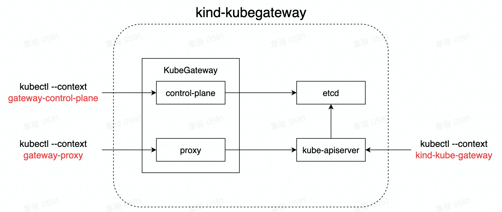

# 快速启动

本文将介绍如何通过 `kind` 在本地在快速部署 kube-gateway 的环境，样例中，我们将以 `kind` 搭建的本地 kubernetes 集群作为 kube-gateway 的上游集群

## 前置条件

请提前安装以下工具
- [go](https://go.dev/doc/install)
- [kind](https://kind.sigs.k8s.io/docs/user/quick-start/#installation)
- [kubectl](https://kubernetes.io/docs/tasks/tools/)
- [yq](https://github.com/mikefarah/yq#install)
- [cfssl](https://github.com/cloudflare/cfssl#installation)

## 启动

通过运行脚本在本地构建环境

```
bash hack/local-up.sh
```

脚本会执行以下任务：
1. 通过 `kind` 创建名为 `kubegateway` 的本地 kubernetes 集群
2. 生成以下密钥和证书
   1. kube-gateway 控制面服务器启动所需的密钥和证书，同时在集群中创建出 secret
   2. kube-gateway 访问 upstream kube-apiserver 所需的密钥和证书
   3. 客户端访问 kube-gateway 控制面服务器所需要的密钥和证书
3. 配置本地 kubectl 的 context
   1. 创建名为 `gateway-control-plane` 的 context 用于连接 kube-gateway 控制面服务器
   2. 创建名为 `gateway-proxy` 的 context 用于连接 kube-gateway 代理
4. 编译并构建镜像
5. 在本地 kubernetes 集群中启动 kube-gateway，并创建路由规则

最终的运行结果如下图



然后
- 可以通过 `kubectl --context gateway-control-plane` 来访问 kube-gateway 的 control-plane
- 可以通过 `kubectl --context gateway-proxy` 来将流量代理到 kind-kubegateway 的 kube-apiserver
- 可以通过 `kubectl --context kind-kubegateway` 来直接访问到 kube-apiserver

### 额外说明
1. kube-gateway 的 control-plane 会监听 9443 端口，而 proxy 会监听 8443 端口，请求确保它们没有被别的进程占用
2. 访问 kube-gateway 的代理需要指定域名 `localhost` 
3. 本样例中配置的用户有超级权限，所以能操作任何的资源，如果想要替换用户，请使用 `output/upstream` 中的 `ca.key` 和 `ca.crt` 来重新生成用户证书


